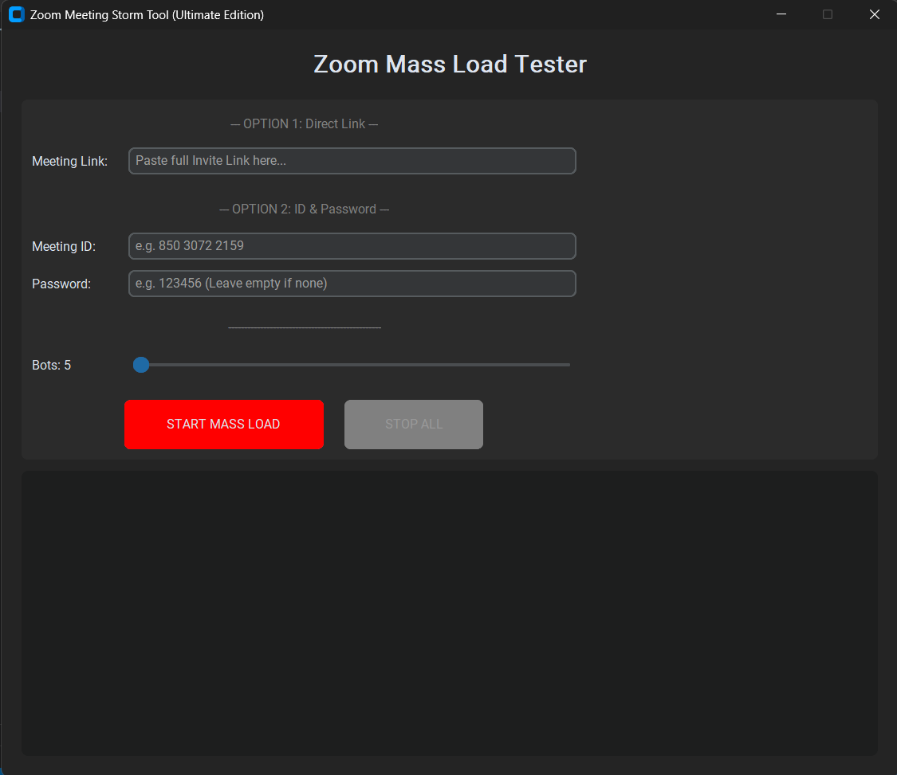

# 🌩️ Zoom Meeting Storm

[](https://www.python.org/downloads/)
[](https://www.selenium.dev/)
[](https://opensource.org/licenses/MIT)
[]()

**Zoom Meeting Storm** is a high-performance load testing artifact designed to simulate mass user concurrency on Zoom meetings. It allows administrators and QA engineers to stress-test meeting capacity, waiting room stability, and join-flow handling by generating hundreds of lightweight, concurrent browser instances.

> **Note:** This tool utilizes "Headless Stealth Mode" to bypass bot detection mechanisms, allowing for accurate simulation of real-user join behaviors without triggering anti-bot blocks.


*(Upload an image named screenshot.png to your repository to see it here)*

---

## ⚡ Key Features

* **🚀 Mass Scale Simulation:** Capable of launching **350+ concurrent bots** from a single standard node.
* **👻 Stealth Headless Mode:** Uses advanced User-Agent spoofing and fingerprint evasion to run invisible browsers that bypass "Are you a robot?" checks.
* **🧠 Human Behavior Simulation:** Implements "Enter Key" submission, tab-navigation, and checkbox interaction to mimic real human input events.
* **⚔️ Dual-Input System:** Supports both **Direct Invite Links** and **Meeting ID + Password** combinations.
* **🛡️ RAM & CPU Optimization:** Features an "Eager Load" strategy and "Staggered Launch" logic to prevent system freezing during high-volume tests.
* **🖥️ Modern GUI:** Built with `customtkinter` for a professional, dark-mode user interface.

---

## 🛠️ Installation

### 📥 [Download Windows App (.exe)](https://github.com/themodernhacker/ZoomMeetingStorm/releases/latest)
*(No Python or coding knowledge required - just download and run)*

### Prerequisites
* **Python 3.10** or higher (Only if running from source).
* **Google Chrome** installed on your machine.
* An active internet connection.

### Setup Guide (Source Code)

1.  **Clone the Repository**
    ```bash
    git clone [https://github.com/themodernhacker/ZoomMeetingStorm.git](https://github.com/themodernhacker/ZoomMeetingStorm.git)
    cd ZoomMeetingStorm
    ```

2.  **Install Dependencies**
    It is recommended to use a virtual environment.
    ```bash
    pip install -r requirements.txt
    ```

3.  **Run the Tool**
    ```bash
    python main.py
    ```

---

## 📖 How to Use

1.  **Launch the Application:** Run the script (or `.exe`) to open the Zoom Meeting Storm GUI.
2.  **Input Meeting Details:**
    * **Option A:** Paste the full Zoom Invite Link (e.g., `https://zoom.us/j/123...?pwd=...`).
    * **Option B:** Enter the Meeting ID and Password manually.
3.  **Set Bot Count:** Use the slider to select the number of participants (1 to 350+).
    * *Recommendation:* Start with 5-10 bots to test the connection before scaling up.
4.  **Start Simulation:** Click **START MASS LOAD**.
    * *Note:* The tool launches bots in "Stealth Mode" (invisible). Watch the internal log window for status updates like `SUCCESS: Participant_25 joined!`
5.  **Stop:** Click **STOP ALL** to instantly terminate all browser processes.

---

## ⚙️ Configuration & Tuning

### Hardware Requirements
* **1-10 Bots:** Runs on any standard laptop (4GB RAM).
* **50-100 Bots:** Requires 8GB RAM.
* **300+ Bots:** Requires 16GB RAM + Quad-Core CPU.

### Headless vs. Visible
By default, the tool runs in **Headless Mode** (invisible) to save RAM.
To see the browsers open (for debugging), open `main.py` and find:
```python
options.add_argument("--headless=new")

Comment this line out by adding a `#` at the start.

---

## ⚠️ Disclaimer

**Educational & Testing Use Only**

This tool is intended solely for **authorized load testing** and **network stability analysis**.

* Do not use this tool on meetings where you do not have explicit permission from the host.
* Do not use this tool to disrupt services (DDoS).
* The developer assumes no liability for misuse of this software.

---

## 🤝 Contributing

Contributions are welcome! Please fork the repository and create a pull request for any feature improvements or bug fixes.

---

**Made with 💻 & ☕**
